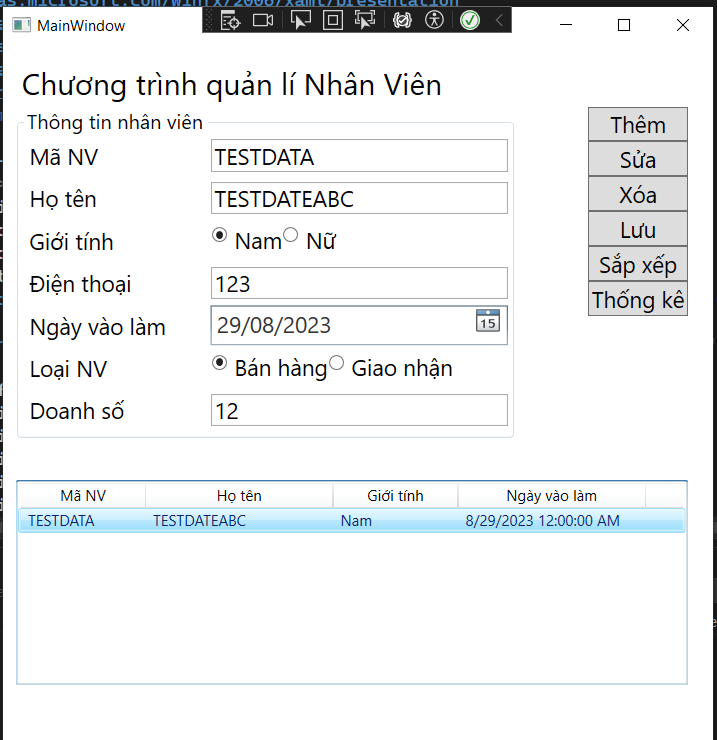

# Employee Management App

This is a simple desktop application for managing employee records. It allows you to perform basic CRUD (Create, Read, Update, Delete) operations on employee data. You can add new employees, edit their information, delete them, and view a list of all employees.

## Features

- Add new employees with details such as name, employee ID, gender, contact number, join date, job type, sales figures, and fuel compensation.
- Edit existing employee information.
- Delete employees from the database.
- Sort the employee list.
- View statistics on employee data.

## Usage

1. Launch the application.
2. Enter employee details in the provided fields.
3. Use the buttons to perform actions like adding, editing, or deleting employees.
4. View the list of employees in the ListView.
5. Sort the employee list as needed.
6. Click the "Statistics" button to view data statistics.

## Demo App

## Technologies Used

- C# for the application logic.
- XAML for the user interface.
- .NET Framework for Windows desktop application development.

